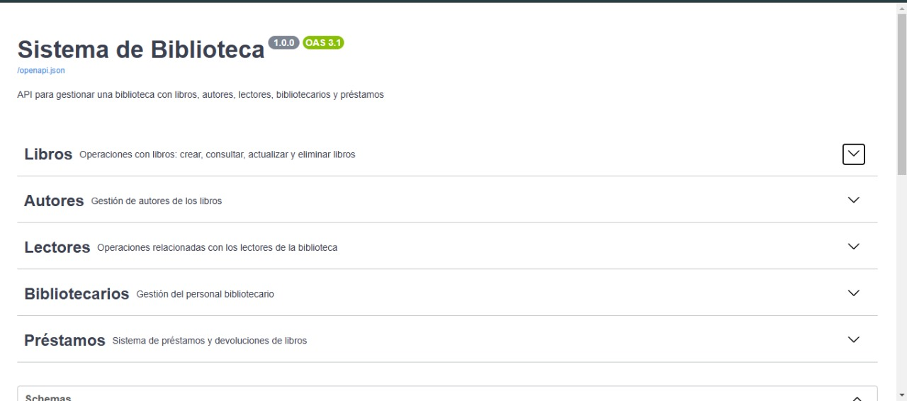
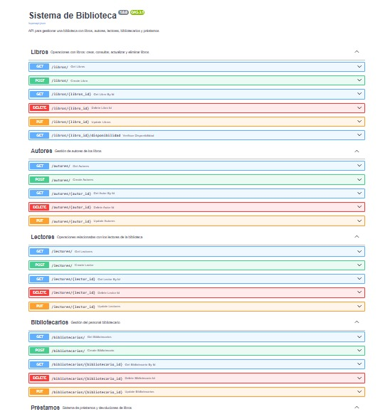
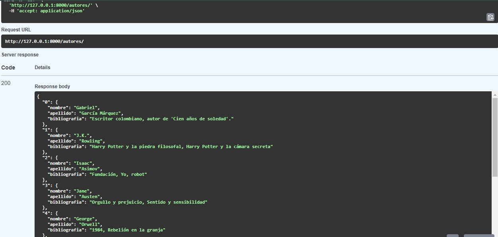
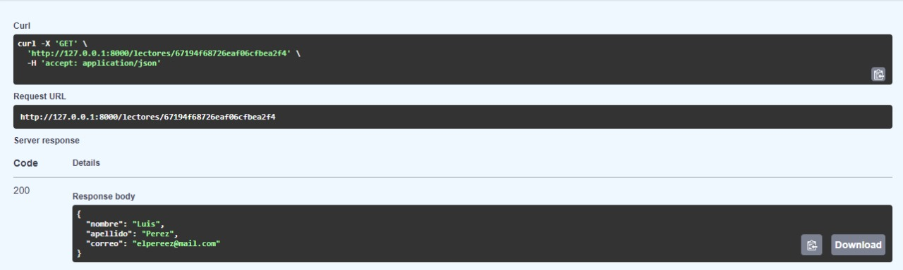
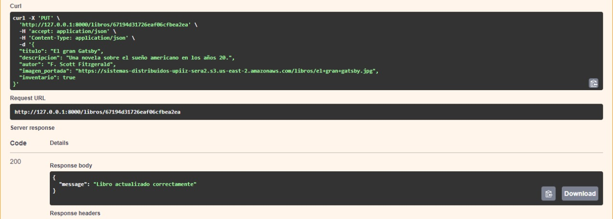
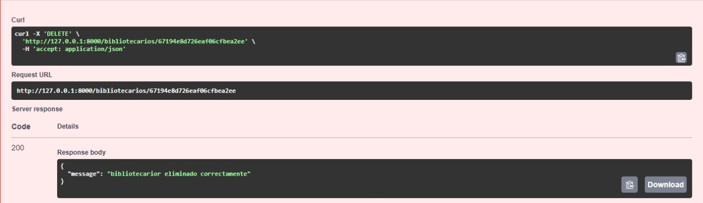
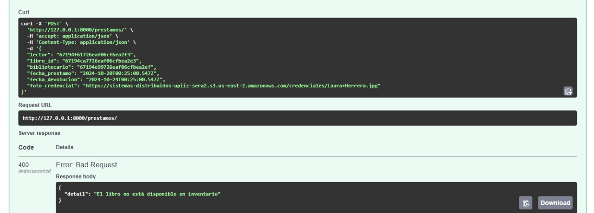
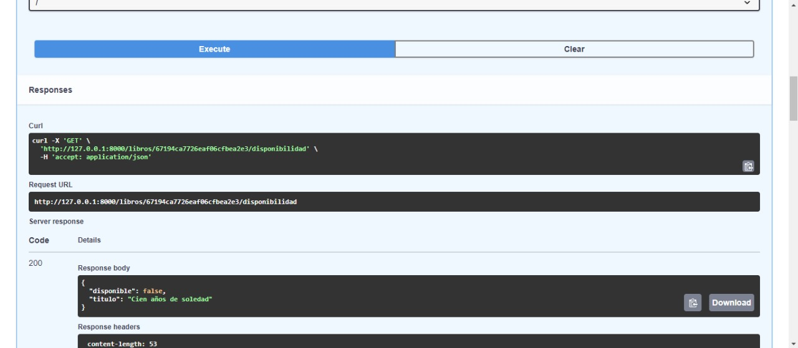
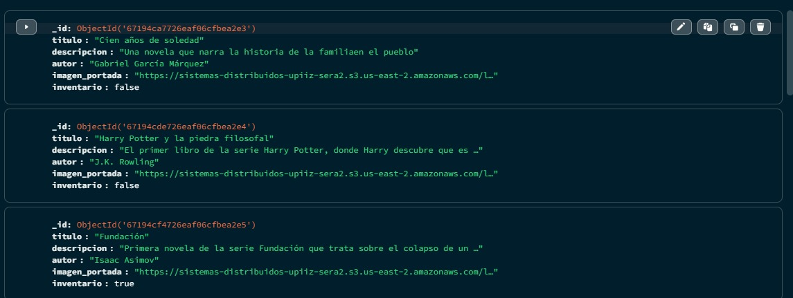
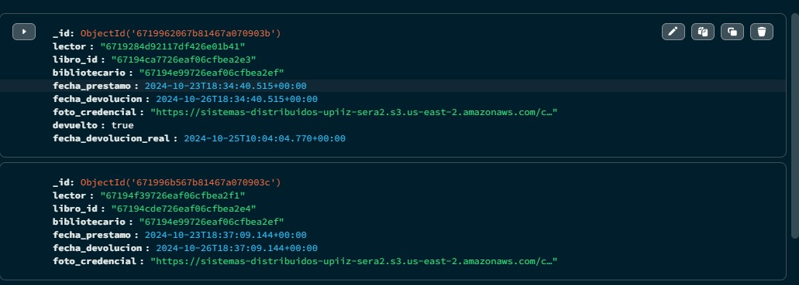

### API para una Biblioteca 

Brandon Hernández Martínez
Sebastián Eli Román Álvarez
Alexandre Almaraz Mayén
Edwin Calben Trejo Aguiñaga 
Gerardo Arias Magaña
José Sebastian Colin Becerra

Se desarrolló una API para un sistema de biblioteca en la cual se pueden registrar lectores, libros, autores de los libros, bibliotecarios e incluso realizar préstamos de los libros pero ojo, únicamente si éstos están disponibles puesto que sólo se cuenta con una unidad de cada libro (es una biblioteca principiante). 

En esta api se pueden encontrar los siguientes métodos que ayudarán a aquel administrador de la biblioteca a realizar distintas acciones basadas en los métodos creados. Dichos métodos son:  
- Get: Este método permite obtener un listado de todos los elementos almacenados en la base de datos dependiendo del apartado en el el que se encuentre ya que este método aplica para lectores, autores, bibliotecarios, libros y prestamos. 
- Get by Id: Este método permite localizar aquel elemento que se desee sólo introduciendo su id (el id de cada lista es generado de manera automática al momento de ingresar el registro) el cual se encuentra en la base de datos. Este método aplica para todos los apartados dentro de la API: lectores, autores, bibliotecarios, libros y prestamos.  
-Post: Este método ayuda a agregar un nuevo elemento a nuestra lista ya sean lectores, autores, bibliotecarios, libros o prestamos. Como se mencionó anteriormente, al momento de generar un nuevo elemento se le asigna un Id único que con el que se pueden realizar distintas consultas.  
-Put: Con este metodo se pueden realiar modificaciones o actualizaciones de los datos creados introduciendo el Id de los lectores, autores, bibliotecarios, libros o prestamos que se deseen. 
-Delete: Por último, este método permite eliminar de la base de datos aquellos elementos que ya no se requieran en ella, sin embargo éste método sólo aplica para ectores, autores, bibliotecarios y libros ya que se optó por no agregarle este método a préstamos por seguridad de éstos para tener un histórico completo de los libros que se han  prestado y los que se han devuleto. 

Referente a los libros, préstamos y sus métodos se decidió agregar dos métodos más para mayor robustez. Se agregó el método **get disponibilidad de libro** en el cual se devuelve el estado bool del libro para su disponibilidad: True para disponible y False para no disponible, esto con la finalidad de verificar si se puede o no realizar un prestamo con mayor facilidad y rapidez ya que sólo se necesita buscarlo por su Id. 
También se agregó un método **post devoluciones** en el cual se coloca el Id del préstamo a devilver y automáticamente el estado del libro pasa a disponible y se actualiza la fecha en la que se entregó oficialmente pues recordemos que el libro debe regresarse tres dias posteriores a su préstamo. En otras palabras este método permite de manera eficaz agregar la fecha de devolución real y cambiar la disponibilidad del libro. 

Los métodos de esta API fueron separados por su clase como se muestra a continuación. 
 
 

Para poder ejecutar correctamente ejecutar la API es necesario crear una base de datos en MongoDB con las colecciones colocadas en el repositorio de GitHub. Estas colecciones contienen algunos ejemplos en distintas situaciones como préstamos no devultos y devuletos, libros disponibles y no disponibles, lectores, bibliotecarios y autores. 
Además se debe de tener descargado FASTAPI. 

A continuación se muetran imágenes que muestran el funcionamiento de algunos métodos y el funcionamiento de la base de datos así como la respuesta de AWS como almacen de imágenes de portadas y credenciales de los lectores. 
En esta primera imagen se muestran las respuestas de obtenidas al usar el método Get para Autores. 

Aqui se muestra el método Gey by Id aplicaddo para los lectores: 

En esta imagen se refleja el resultado de Put aplicado para un Libro: 

Para el método Delete de un Bibliotecario la respuesta se represnta así de manera exitosa: 

Aqui se muestran la respuesta al buscar un libro que no se encuantra en el inventario 

Aquí se muestra el método añadido para verificar la disponibilidad de un libro: 

En la siguiente iágen se refleja en la base de datos cómo cambia el estado de disponibilidad de los libros dependiendo de si están rentados o no: 

Ahora se muestra en la base de datos los libros prestados y los libros devuletos con la fecha de tres dias posteriores para devolver y los devueltos señalando la fecha real de la devolución: 

En este caso el libro fue devulto el mismo dia, sin embargo si se realiza la devoluxcón a fecha que sea se registrará esa fecha. 

En las siguientes imágenes se muestran las fotografias de las credenciales de los lectores y de las portadas de los libros almacenados en AWS accediendo mediante el link. 

Esperando que estas imágenes sean suficientes para demostrar el éxito de la API puesto que fue un reto entretenido el planificar laestructura que se tentria, la comodidad al usarla así como su funcionalidad en el mundo real. 

